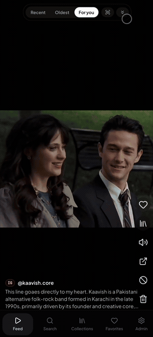
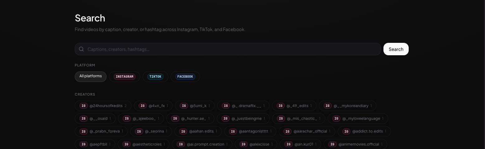
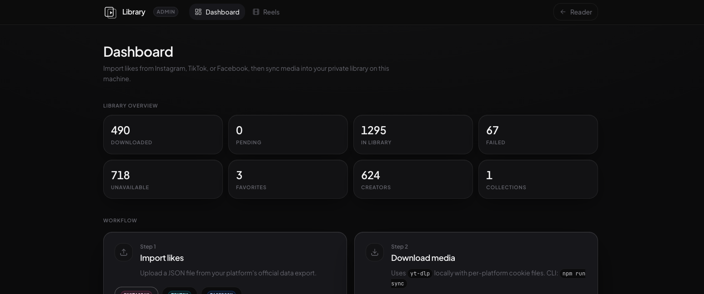
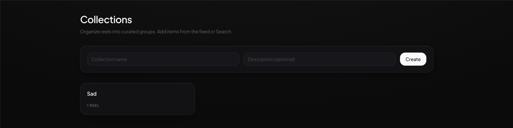

# Like Player

**Turn your liked videos into a private, searchable, TikTok-style library.**

Import likes from Instagram, TikTok, and Facebook using each platform's official
data export. Download the media locally with `yt-dlp`. Browse everything in a
fast web app — vertical feed, full-text search, favorites, and custom collections.

Not affiliated with Meta, ByteDance, or any social platform. Use only with **your
own** exported data.

[](LICENSE)
[](https://github.com/ibrahimjspy/insta-like-player/actions/workflows/ci.yml)
[](package.json)
[](https://nextjs.org)

<p align="center">
  <br>
  <sub><b>For you feed</b> — vertical, snap-scrolling, ranked by your watch behavior</sub>
</p>

---

## Screenshots

<p align="center"><b>Search</b> — caption, creator, or hashtag, filtered by platform</p>
<p align="center"></p>

<p align="center"><b>Admin dashboard</b> — library stats, per-platform import, and live sync</p>
<p align="center"></p>

<p align="center"><b>Collections</b> — curate subsets without touching the original platforms</p>
<p align="center"></p>

---

## Why this exists

Social platforms bury your likes in export ZIPs and expired CDN links. Like Player
gives you:

- **One library** for Instagram Reels, TikTok videos, and Facebook saved/reacted videos
- **Local files** — no streaming from expired URLs; seekable playback from disk
- **A real feed** — Recent, Oldest, or a **For you** ranker that learns from watch time
- **Search** — caption, creator, hashtag, and platform filters
- **Collections & favorites** — curate subsets without touching the original platforms
- **Self-hosted** — single-user, runs on your machine; optional Tailscale access from your phone

No scraping. No login automation. Discovery comes from official exports; downloads
use `yt-dlp` with optional session cookies you provide.

---

## How it works

```
Platform export (JSON)  ──►  ingest  ──►  PostgreSQL  ◄──  sync (yt-dlp)  ──►  data/media
                                              │
                                              ▼
                                         Next.js web app
                               Reader (/)  ·  Admin (/admin)
```

| Step | What happens |
|------|----------------|
| **Import** | Parse `liked_posts.json`, `user_data_tiktok.json`, or Facebook `posts_and_comments.json` / saved collections into the DB |
| **Sync** | Download video + thumbnail + metadata for each pending item |
| **Browse** | Stream from `/api/media/...` with HTTP range support (scrubbing works) |

---

## Features

### Reader (`/`)

- Infinite vertical feed with tap-to-pause chrome
- Sort: **Recent** · **Oldest** · **For you** (personalized from watch behavior)
- Auto-scroll and video-only modes while paused
- Search by text, creator, or platform
- Favorites and user-defined collections

### Admin (`/admin`)

- Upload exports per platform
- Run and monitor background sync
- Inspect reel status (pending, downloaded, failed, unavailable)

### For you feed

Not random — ranks reels from engagement signals (watch time, loops, deep watches
vs quick skips, creator/hashtag/collection affinity). Tune weights in
`src/lib/feed/config.ts`. Design doc: [docs/FEED_RECOMMENDATIONS.md](docs/FEED_RECOMMENDATIONS.md).

---

## Supported platforms

| Platform | Export file | CLI flag |
|----------|-------------|----------|
| Instagram | `liked_posts.json` (Likes, JSON, all time) | `--platform instagram` (default) |
| TikTok | `user_data_tiktok.json` (include **Likes**) | `--platform tiktok` |
| Facebook | `likes_and_reactions/posts_and_comments.json`, saved collections, or `your_saved_items.json` | `--platform facebook` |

Each platform uses the same pipeline; media is stored as
`<platform>_<id>.mp4` (Instagram keeps bare shortcodes for backward compatibility).

---

## Quick start

**Prerequisites:** Node.js 20+, Docker (for Postgres), [`yt-dlp`](https://github.com/yt-dlp/yt-dlp)

```bash
git clone https://github.com/ibrahimjspy/insta-like-player.git
cd insta-like-player
npm install

cp .env.example .env          # edit DATABASE_URL if port 5432 is taken
npm run db:up && npm run db:push
npm run dev                   # http://localhost:3000
```

### Import your likes

**Admin UI:** open `/admin` → pick platform → upload JSON → Sync.

**CLI:**

```bash
# Instagram (default)
npm run ingest -- path/to/liked_posts.json

# TikTok
npm run ingest -- --platform tiktok path/to/user_data_tiktok.json

# Facebook
npm run ingest -- --platform facebook path/to/posts_and_comments.json

npm run sync                  # download pending media
npm run sync -- --limit 50    # batch of 50
npm run sync -- --retry       # include previously failed reels
```

### Cookies (recommended for downloads)

Platforms gate media behind login. Export a Netscape `cookies.txt` from a
logged-in browser session and set per-platform paths in `.env`:

```bash
YTDLP_COOKIES_INSTAGRAM="./data/cookies-instagram.txt"
YTDLP_COOKIES_TIKTOK="./data/cookies-tiktok.txt"
YTDLP_COOKIES_FACEBOOK="./data/cookies-facebook.txt"
```

TikTok often needs browser impersonation — see comments in `.env.example`.

---

## Configuration

All settings flow through `.env` → `src/lib/config.ts`:

| Variable | Default | Description |
|----------|---------|-------------|
| `DATABASE_URL` | local Docker Postgres | PostgreSQL connection string |
| `MEDIA_DIR` | `./data/media` | Downloaded videos and thumbnails |
| `FEED_PAGE_SIZE` | `10` | Reels per infinite-scroll page |
| `YTDLP_PATH` | `yt-dlp` | Path to yt-dlp binary |
| `YTDLP_COOKIES_*` | _(unset)_ | Per-platform Netscape cookies |
| `YTDLP_IMPERSONATE_TIKTOK` | `chrome` | TLS fingerprint for TikTok 403s |
| `SYNC_RATE_LIMIT_MS` | `4000` | Delay between sequential downloads |
| `SYNC_MAX_RETRIES` | `3` | Retries before marking FAILED |
| `SYNC_REELS_ONLY` | `true` | Skip non-video likes (e.g. Instagram `/p/` photos) |

---

## Scripts

| Command | Description |
|---------|-------------|
| `npm run dev` | Development server |
| `npm run build` | Production build + typecheck |
| `npm test` | Vitest unit tests |
| `npm run lint` | ESLint |
| `npm run ingest` | Import a platform export |
| `npm run sync` | Download pending reels |
| `npm run db:up` / `db:down` | Start/stop Postgres container |
| `npm run db:push` | Apply Prisma schema |
| `npm run serve` | Production server on port 7319 |

---

## Project structure

```
prisma/schema.prisma       Reels, creators, hashtags, collections, engagement
src/lib/platforms/         Instagram, TikTok, Facebook export parsers
src/lib/feed/              For you scoring, taste classification, SQL ranker
src/lib/queries.ts         Feed, search, collections, favorites
src/app/(reader)/          Feed, search, collections, favorites
src/app/admin/             Import, sync, reel management
src/app/api/media/         Local media streaming with range requests
docs/                      FEED_RECOMMENDATIONS.md, DEPLOYMENT.md
```

---

## Self-hosting

Run as an always-on personal server and reach it from your phone over
[Tailscale](https://tailscale.com) — no cloud, no public exposure. See
**[docs/DEPLOYMENT.md](docs/DEPLOYMENT.md)**.

```bash
npm run build
bash scripts/install-service.sh   # macOS launchd agent on port 7319
tailscale serve --bg 7319         # private HTTPS on your tailnet
```

---

## Testing

```bash
npm test            # full suite
npm test -- src/lib/feed   # after feed algorithm changes
```

Tests cover export parsers (all three platforms), feed pagination and scoring,
search filters, media path safety, and yt-dlp helpers. Prisma is mocked — no DB
required.

---

## Tech stack

Next.js 16 (App Router) · TypeScript · Tailwind CSS v4 · PostgreSQL · Prisma 7 ·
`yt-dlp` · Docker Compose · Vitest

---

## Legal & privacy

- Only use with **your own** exported data. The app does not bypass platform access controls.
- Media and exports live in `data/` (gitignored). Nothing personal belongs in git.
- Automated downloading may conflict with platform Terms of Service. Discovery uses
  official exports; downloads are read-only fetches of content you already liked.
  **Use at your own risk.**

---

## Contributing

Issues and PRs welcome — see [CONTRIBUTING.md](CONTRIBUTING.md). For AI-assisted
development, see [CLAUDE.md](CLAUDE.md).

If this project saves you from losing liked videos to the algorithm, consider
**starring the repo** — it helps others find it.

## License

[MIT](LICENSE)
