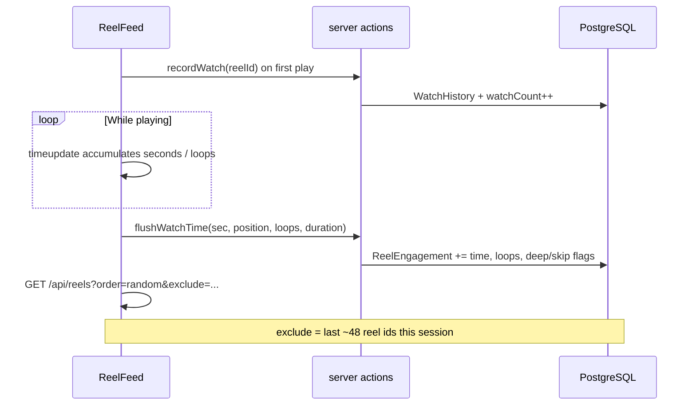

# For you feed (personalized recommendations)

The reader’s **For you** tab (`/?order=random`) ranks your downloaded reels from watch
behavior—not pure randomness. This document explains data flow, tuning, and how to
change the algorithm safely.

## Quick reference

| Layer | Location |
|-------|----------|
| Tune weights / thresholds | [`src/lib/feed/config.ts`](../src/lib/feed/config.ts) |
| Session rules (deep watch vs skip) | [`src/lib/feed/taste.ts`](../src/lib/feed/taste.ts) |
| SQL scoring query | [`src/lib/feed/sql.ts`](../src/lib/feed/sql.ts) |
| DB rollup writes | [`src/lib/feed/engagement.ts`](../src/lib/feed/engagement.ts) |
| Feed API | [`src/lib/queries.ts`](../src/lib/queries.ts) → `getFeed({ order: "random" })` |
| Player metrics | [`src/components/ReelFeed.tsx`](../src/components/ReelFeed.tsx) |
| Tests | [`src/lib/feed/*.test.ts`](../src/lib/feed/) |

```bash
npm test -- src/lib/feed    # after any config or SQL change
```

## Data model

### `ReelEngagement` (one row per reel)

Fast rollup used by the scoring query:

| Column | Meaning |
|--------|---------|
| `watchCount` | Times a session started (tap into view / play) |
| `totalWatchSec` | Cumulative seconds while playing |
| `maxPositionSec` | Furthest playback position reached |
| `loopCount` | Full loop completions detected client-side |
| `deepWatchCount` | Sessions classified as “really watched” |
| `quickSkipCount` | Sessions classified as bounce / skip |
| `lastWatchedAt` | Last activity (drives time decay) |

### `WatchHistory`

Append-only log per session start (audit / future resume). Backfill seeds
`ReelEngagement` once when the rollup table is empty.

## Client → server pipeline



**Checkpoint:** every 30s, if ≥12s accumulated, flush early so tab closes don’t lose data.

## Scoring algorithm (SQL)

One query per page:

1. **`eng`** — Per-reel decayed engagement (`decayed_eng`) from rollup + reel duration.
2. **`creator_scores` / `tag_scores` / `collection_scores` / `duration_taste`** — Aggregate taste vectors.
3. **`loved_creators` / `strong_tags`** — Top creators/tags by normalized score.
4. **`candidates`** — Each downloaded reel gets a **score**:
   - **Positive:** unseen boost, watch depth, creator/tag/collection affinity, duration taste, favorites, discovery (unseen from loved creators / strong tags).
   - **Negative:** repeated quick skips, over-exposure, watched in last 3h / 24h.
5. **Sample** — `ORDER BY -LN(random()) / score` (Gumbel trick) so high scores win often but not always the same top 10.

### Session exclude list

`ReelFeed` sends `exclude=id1,id2,...` (max 48) so the next infinite-scroll batch
doesn’t repeat what’s already on screen.

## Tuning guide

Edit [`FEED_TASTE_CONFIG`](../src/lib/feed/config.ts):

| Goal | Knobs |
|------|--------|
| More discovery of unseen reels | ↑ `scoreWeights.unseenBoost`, `lovedCreatorUnseen`, `tagDiscoveryUnseen` |
| Stick to known creators | ↑ `scoreWeights.creatorAffinity`, ↓ `unseenBoost` |
| Less repetition same session | ↑ `scoreWeights.recent3hPenalty`; client `exclude.maxSessionIds` |
| Forgive skips | ↓ `scoreWeights.quickSkipPenalty`, loosen `classify.*` thresholds |
| Prefer longer/shorter reels | Adjust `duration.*` bounds and `durationTaste*` weights |
| Faster “forgetting” old taste | ↓ `decayHalfLifeDays` |

**Important:** `engagementRaw` weights in config must stay aligned with the `eng` CTE in
`sql.ts` (both are generated from the same config). `reelDecayedEngagement()` in
`taste.ts` mirrors the formula for tests.

## API

```
GET /api/reels?order=random
GET /api/reels?order=random&exclude=<uuid>,<uuid>,...
```

Response shape unchanged: `{ items, nextCursor: "more" | null }`.

## Testing strategy

| Test file | Covers |
|-----------|--------|
| `config.test.ts` | Sane config invariants |
| `taste.test.ts` | Classification, decay, completion |
| `sql.test.ts` | CTEs present, config weights embedded in SQL |
| `smart-feed.test.ts` | Exclude list normalization |
| `engagement.test.ts` | DB write behavior (mocked Prisma) |
| `queries.test.ts` | `getFeed` integration (mocked DB) |

No Postgres required for unit tests.

## Cold start

No engagement rows → everything is “unseen” with exploration boosts; Gumbel noise
keeps order varied. Taste improves as you watch on **For you**.

## Related schema

See `ReelEngagement` in [`prisma/schema.prisma`](../prisma/schema.prisma). After schema
changes: `npm run db:push`.
